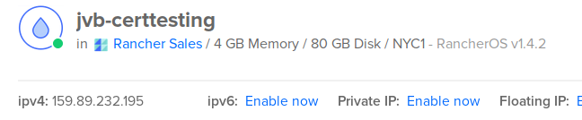
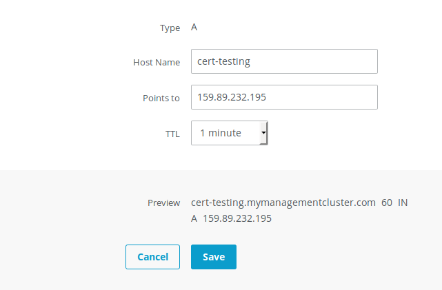
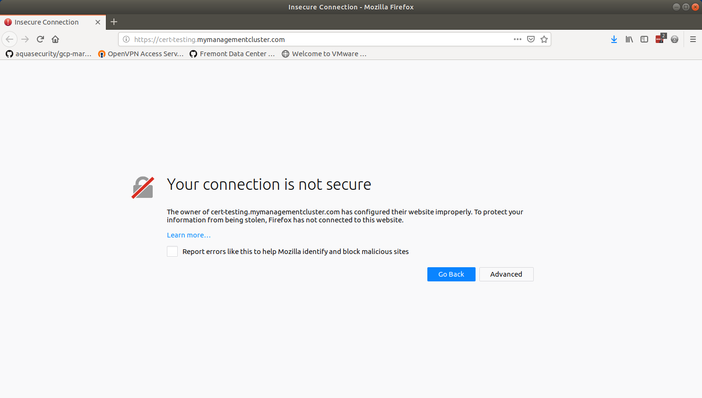
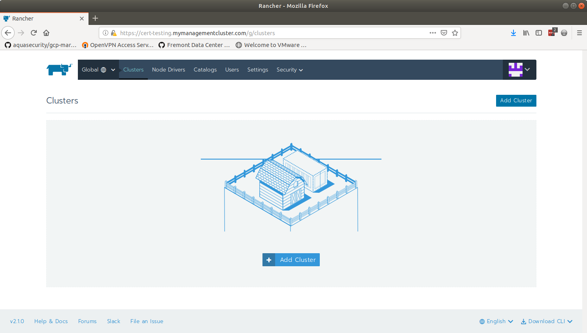
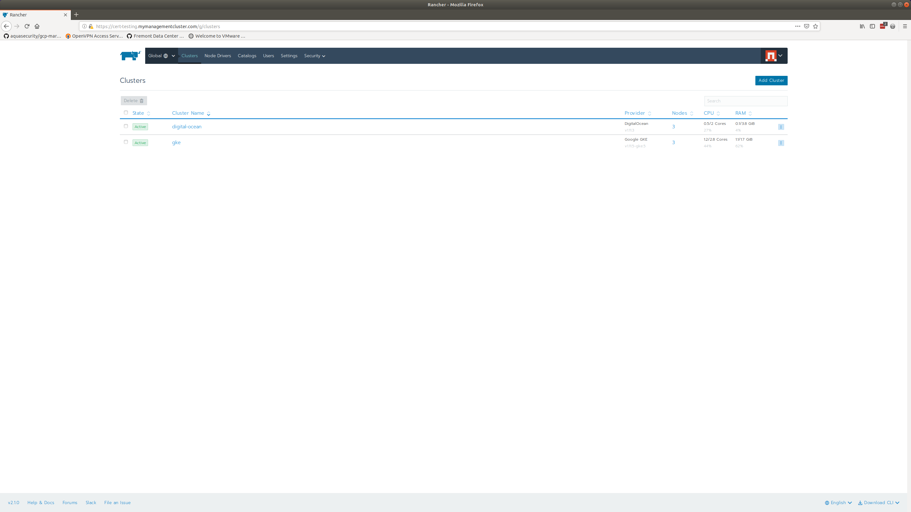
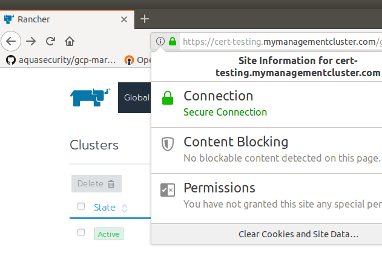

# Upgrading from Rancher Generated Certificates to a full user-provided Certificate Chain

<div style="border: 1px red solid; padding: 5px">
    Warning. No backup of this cluster is taken.  This is for testing purposes.  When doing this against a production system, be sure to backup according to Rancher documentation.
</div>

## Start Rancher Single Node with self-signed certificates

- Create a Rancher 1.4.2 OS for a standalone Rancher Management Server



- Start a single-node Rancher Server with Rancher Managed certificates on 2.1.1

```sh

docker run -d --restart=unless-stopped \
-p 80:80 -p 443:443 \
--name rancher-2.1.0 \
rancher/rancher:v2.1.0
Unable to find image 'rancher/rancher:v2.1.0' locally
v2.1.0: Pulling from rancher/rancher
124c757242f8: Already exists
9d866f8bde2a: Pull complete
fa3f2f277e67: Pull complete
398d32b153e8: Pull complete
afde35469481: Pull complete
fbc574286285: Pull complete
1b891d00139c: Pull complete
48ef739e8703: Pull complete
e61e49128f73: Pull complete
f9d4fe374de5: Pull complete
776e2b2c49ad: Pull complete
a8872050d407: Pull complete
22a33ff4cf73: Pull complete
Digest: sha256:3f4a3d10375b4672bf0680d7f24475dc8b9bc7400490dd940655c1b26d62528a
Status: Downloaded newer image for rancher/rancher:v2.1.0
1c2ab0cc602d0f4f1710bae17c2cb3540650857005a763ed4e749c16dbeb3c18

```

- Create an DNS A Record for cert-testing.mymanagementcluster.com



- Navigate to Rancher and make sure that the cert-chain is not fully trusted.



- Create an exception and setup Rancher



- Add a cluster for the upgrade test



### Create a trusted certificate chain

- Create a full certificate chain for this server.  Make sure the CA is trusted by the test-machine.  This is outside of the scope of this document.
- For this document I used the script below.

```sh

openssl genrsa -out myclustermanager-ca.key 2048
Generating RSA private key, 2048 bit long modulus (2 primes)
....+++++
...........+++++
e is 65537 (0x010001)

openssl req -x509 -new -nodes -key myclustermanager-ca.key -sha256 -days 1024 -out myclustermanager-ca.pem
You are about to be asked to enter information that will be incorporated
into your certificate request.
What you are about to enter is what is called a Distinguished Name or a DN.
There are quite a few fields but you can leave some blank
For some fields there will be a default value,
If you enter '.', the field will be left blank.
-----
Country Name (2 letter code) [AU]:US
State or Province Name (full name) [Some-State]:Pennsylvania
Locality Name (eg, city) []:Philadelphia
Organization Name (eg, company) [Internet Widgits Pty Ltd]:My Management Cluster
Organizational Unit Name (eg, section) []:
Common Name (e.g. server FQDN or YOUR name) []:mymanagementcluster.com
Email Address []:jvb@rancher.com

openssl genrsa -out cert-testing.mymanagementcluster.com.key 2048
Generating RSA private key, 2048 bit long modulus (2 primes)
........................+++++
.......................................................+++++
e is 65537 (0x010001)

openssl req -new -key cert-testing.mymanagementcluster.com.key -out cert-testing.mymanagementcluster.com.csr
You are about to be asked to enter information that will be incorporated
into your certificate request.
What you are about to enter is what is called a Distinguished Name or a DN.
There are quite a few fields but you can leave some blank
For some fields there will be a default value,
If you enter '.', the field will be left blank.
-----
Country Name (2 letter code) [AU]:US
State or Province Name (full name) [Some-State]:Pennsylvania
Locality Name (eg, city) []:Philadelphia
Organization Name (eg, company) [Internet Widgits Pty Ltd]:My Management Cluster
Organizational Unit Name (eg, section) []:
Common Name (e.g. server FQDN or YOUR name) []:cert-testing.mymanagementcluster.com
Email Address []:jvb@rancher.com

Please enter the following 'extra' attributes
to be sent with your certificate request
A challenge password []:
An optional company name []:


openssl x509 -req -in cert-testing.mymanagementcluster.com.csr -CA myclustermanager-ca.pem -CAkey myclustermanager-ca.key -CAcreateserial -out cert-testing.mymanagementcluster.com.pem -days 1024 -sha256
Signature ok
subject=C = US, ST = Pennsylvania, L = Philadelphia, O = My Management Cluster, CN = cert-testing.mymanagementcluster.com, emailAddress = jvb@rancher.com
Getting CA Private Key

```

### Upgrade Rancher and change the settings to use the provided certificate chain

- Stop the running container.

```sh

docker stop rancher-2.1.0
rancher-2.1.0

```

- Create a volume container for the upgrade per [Single Node Upgrade](https://rancher.com/docs/rancher/v2.x/en/upgrades/upgrades/single-node-upgrade/) or [Single Node Upgrade - Air Gap](https://rancher.com/docs/rancher/v2.x/en/upgrades/upgrades/single-node-air-gap-upgrade/).  Backup and other details are ommitted here.

```sh

docker create --volumes-from \
rancher-2.1.0 --name rancher-data \
rancher/rancher:v2.1.4
Unable to find image 'rancher/rancher:v2.1.4' locally
v2.1.4: Pulling from rancher/rancher
32802c0cfa4d: Pull complete
da1315cffa03: Pull complete
fa83472a3562: Pull complete
f85999a86bef: Pull complete
b80e26f604e0: Pull complete
e2b355178609: Pull complete
a00bebfc6f0e: Pull complete
00df48523787: Pull complete
24bda8da7909: Pull complete
fe2a3a1ed064: Pull complete
b54f1b7a12a4: Pull complete
a56b7f1489fd: Pull complete
Digest: sha256:4b4542027a79d232423aa05d2c52d971b46aedd2d66191cdb0654a02d9b9e7b2
Status: Downloaded newer image for rancher/rancher:v2.1.4
15dfbb0be6975aafae7f6fe74be8ff558925b4b6cfbf33dd4b82263fd424a849

```

- Start the upgraded version using the volume container.  Add additional arguments for the new certificate chain per [Single Node Install, Option B-Bring Your Own Certificate: Self-Signed](https://rancher.com/docs/rancher/v2.x/en/installation/single-node/).
  - For our example certificates are on the host machine at `/certs`

```sh

docker run -d \
--name rancher-2.1.4 \
--restart=unless-stopped \
-p 80:80 -p 443:443 \
-v /certs/cert-testing.mymanagementcluster.com.pem:/etc/rancher/ssl/cert.pem \
-v /certs/cert-testing.mymanagementcluster.com.key:/etc/rancher/ssl/key.pem \
-v /certs/myclustermanager-ca.pem:/etc/rancher/ssl/cacerts.pem \
--volumes-from rancher-data \
rancher/rancher:v2.1.4
1352750b5d68cf1f832b5f202cca0da933ce466e201232db060b951ea0af7ae3

```

- Navigate to the upgraded cluster and check the certificate chain.
  - Note: Adding the CA Certificate to your client is outside of the scope of this document. For this test the CA Certificate was added to the browser manually.

